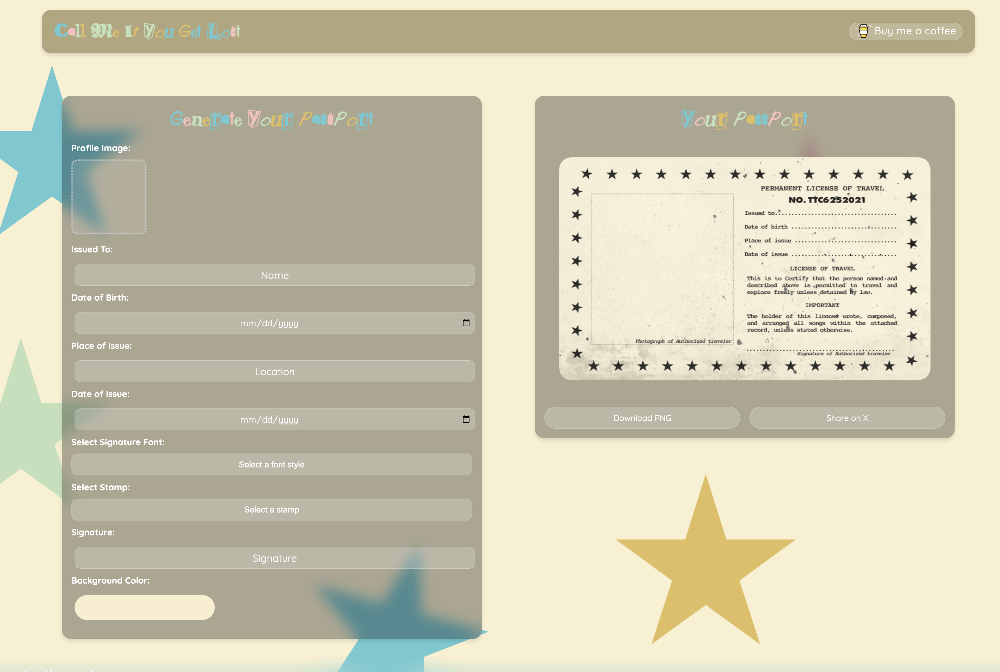

# 🎟 **Call Me If You Get Lost – License Generator**  
  
  
  
  
  

🎶 **"Pardon me, excuse me..."**  

If you missed out on **Tyler, The Creator’s** official **Call Me If You Get Lost** license generator before it disappeared, **here’s your second chance.**  

This project brings back the **CMIYGL ID Generator**, letting fans create **custom ID cards** inspired by Tyler’s album rollout. Whether you're rocking *Sir Baudelaire* vibes or just want to flex a **legit-looking passport-style ID**, this is for you.  

🎟 **Available online:** [callmeifyougetlost.online](https://callmeifyougetlost.online/)  

---

## 📜 **About This Project**  
When **Call Me If You Get Lost** dropped, fans could generate their own **CMIYGL ID cards** through an official website. But like most good things, that site is **no longer available**.  

So, instead of letting the idea disappear, this project **revives the experience**. Now, you can customize your own **CMIYGL-style ID** and download it—just like in 2021.  

---

## 🚀 **Features**  
- 🎟 **Create your own CMIYGL-style ID**  
- 🖼 **Upload a custom profile picture**  
- 🎨 **Choose your own background color**  
- ✍️ **Edit personal details (Name, DOB, etc.)**  
- 🔍 **Live Preview before downloading**  
- 🌐 **100% Web-Based – No installation needed**  

---

## 🌎 **How to Use**  
1. **Visit** [callmeifyougetlost.online](https://callmeifyougetlost.online/)  
2. **Enter your details** (Issued To, DOB, etc.)  
3. **Upload your picture & choose a background**  
4. **Download your custom CMIYGL ID**  

That’s it. **Welcome to the world of Sir Baudelaire.**  

---

## 🛠 **For Developers – Installation & Setup**  
If you want to run this project locally:  

### **1️⃣ Clone the repository:**  
```git clone https://github.com/BlazeWheeler/CMIYGL-Generator.git
cd CMIYGL-Generator
node app.js
```
## 📸 Screenshots  
## 📸 Screenshots  

### 🔹 Preview 1  
  

### 🔹 Preview 2  
  

*Recreating the iconic CMIYGL ID look.*


*Recreating the iconic CMIYGL ID look.*

---

## 📌 Roadmap  
✅ **Recreate the original CMIYGL generator experience**  
✅ **Enable custom images & backgrounds**  
🚧 **Improve mobile responsiveness**  
🚧 **Add more customization options**  

---

## 🤝 Contributing  
Feel free to **submit issues, suggest features, or fork this project** if you’d like to improve it.  

---

## 📝 License  
This project is licensed under the **MIT License**. See [LICENSE](./LICENSE) for details.  

---

## 🎯 Support & Follow  
⭐ **If you love Tyler & this project, give it a star!**  

📌 **Live at:** [callmeifyougetlost.online](https://callmeifyougetlost.online/)  

🎟 *Bon voyage.*  


<!-- CONTACT -->
## Contact

Blaze Wheeler - [@blazew] - blaze@blazew.me

<p align="right">(<a href="#readme-top">back to top</a>)</p>